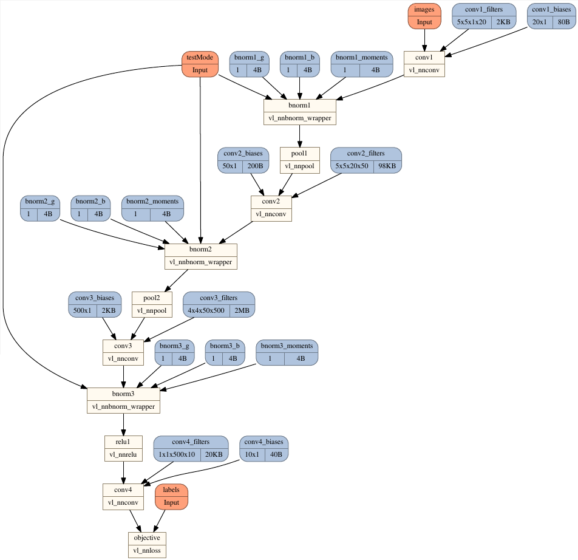

# AutoNN #
AutoNN (cf. [auton](https://en.wikipedia.org/wiki/Auton)) is a functional wrapper for [MatConvNet](http://www.vlfeat.org/matconvnet/), implementing automatic differentiation.

It builds on MatConvNet's low-level functions and Matlab's math operators, to create a modern deep learning API with automatic differentiation at its core. The guiding principles are:

- Concise syntax for fast research prototyping, mixing math and deep network blocks freely.
- No boilerplate code to create custom layers, implemented as Matlab functions operating on GPU arrays.
- Minimal execution kernel for backpropagation, with a focus on speed.

Compared to the SimpleNN and DagNN [wrappers](http://www.vlfeat.org/matconvnet/wrappers/) for MatConvNet, AutoNN is less verbose and has lower computational overhead.


# Requirements #

* A recent Matlab (preferably 2015b onwards, though older versions may also work).
* MatConvNet [version 24](http://www.vlfeat.org/matconvnet/) or [more recent](https://github.com/vlfeat/matconvnet).


# AutoNN in a nutshell #

Defining an objective function with AutoNN is as simple as:

```Matlab
% define inputs and learnable parameters
x = Input() ;
y = Input() ;
w = Param('value', randn(1, 100)) ;
b = Param('value', 0) ;

% combine them using math operators, which define the prediction
prediction = w * x + b ;

% define a loss
loss = sum(sum((prediction - y).^2)) ;

% compile and run the network
net = Net(loss) ;
net.eval({x, rand(100, 1), y, 0.5}) ;

% display parameter derivatives
net.getDer(w)
```

AutoNN also allows you to use MatConvNet layers and custom functions.

Here's a simplified 20-layer ResNet:

```Matlab
images = Input() ;

% initial convolution
x = vl_nnconv(images, 'size', [3 3 3 64], 'stride', 4) ;

% iterate blocks
for k = 1:20
  % compose a residual block, based on the previous output
  res = vl_nnconv(x, 'size', [3 3 64 64], 'pad', 1) ;  % convolution
  res = vl_nnbnorm(res) ;  % batch-normalization
  res = vl_nnrelu(res) ;  % ReLU
  
  % add it to the previous output
  x = x + res ;
end

% pool features across spatial dimensions, and do final prediction
pooled = mean(mean(x, 1), 2) ;
prediction = vl_nnconv(pooled, 'size', [1 1 64 1000]) ;
```

All of MatConvNet's layer functions are overloaded, as well as a growing list of Matlab math operators and functions. The derivatives for these functions are defined whenever possible, so that they can be composed to create differentiable models. A full list can be found [here](matlab/@Layer/methods.txt).


# Documentation #

## Tutorial ##

The easiest way to learn more is to follow this short [tutorial](doc/TUTORIAL.md). It covers all the basic concepts and a good portion of the API.


## Help pages ##

Comprehensive documentation is available by typing `help autonn` into the Matlab console. This lists all the classes and methods, with short descriptions, and provides links to other help pages.


## Converting SimpleNN/DagNN models ##

For a quicker start or to load pre-trained models, you may want to import them from the existing wrappers. Check `help Layer.fromDagNN`.


## Examples ##

The `examples` directory has heavily-commented samples. These can be grouped in two categories:

- The *minimal* examples (in `examples/minimal`) are very short and self-contained. They are scripts so you can inspect and explore the resulting variables in the command window. The SGD optimization is a simple `for` loop, so if you prefer to have full control over learning this is the way to go.

- The *full* examples (in `examples/cnn` and `examples/rnn`) demonstrate training using `cnn_train_autonn`, equivalent to the MatConvNet `cnn_train` function. This includes the standard options, such as checkpointing and different solvers.

The ImageNet and MNIST examples work exactly the same as the corresponding MatConvNet examples, except for the network definitions. There is also a text LSTM example (`examples/rnn/rnn_lstm_shakespeare.m`), and a CNN on toy data (`examples/cnn/cnn_toy_data_autonn.m`), which provides a good starting point for training on custom datasets.


# Screenshots #

Some gratuitous screenshots, though the important bits are in the code above really:

*Training diagnostics plot*


*Graph topology plot*


